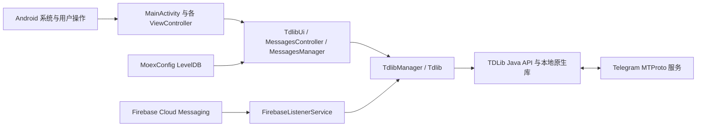

# moeGramX Ghost 项目说明

## 项目用途

本项目是基于 moeGramX、Telegram X 和 TDLib 的 Android Telegram 客户端分支。除上游聊天、媒体、通话和多账号能力外，当前分支加入了 Ghost Mode、Read until、消息过滤、Shadow Ban，以及对 Telegram 公开频道搜索链接的应用内处理。

## 整体架构



应用使用单 Activity 加自定义 `ViewController` 导航栈。`MainActivity` 接收启动、分享和外部链接 Intent；业务页面通过 `TdlibUi`、`Tdlib` 和 TDLib 异步 API 读取或修改 Telegram 状态。TDLib 负责 MTProto 网络连接、账号授权、本地消息数据库与文件下载。

## 主要目录与文件

- `app/`：Android 应用、Java/Kotlin UI、资源、Manifest、JNI 构建入口和产品风味。
- `app/src/main/java/org/thunderdog/challegram/MainActivity.java`：应用入口、导航初始化和外部 Intent 分发。
- `app/src/main/java/org/thunderdog/challegram/ui/MainController.java` 与 `ExternalShareUtils.java`：接收外部文件、提取 URI、推断 MIME 和校验读取范围，生成待确认的分享内容。
- `app/src/main/java/org/thunderdog/challegram/telegram/Tdlib.java`：单账号 TDLib 封装、缓存、更新分发及 Telegram 操作。
- `app/src/main/java/org/thunderdog/challegram/telegram/TdlibUi.java`：把 TDLib 对象和链接类型转换为页面导航、弹窗及其他 UI 行为。
- `app/src/main/java/org/thunderdog/challegram/ui/MessagesController.java`：聊天、消息搜索和消息交互页面。
- `app/src/main/java/org/thunderdog/challegram/component/chat/MessagesManager.java`：消息加载、搜索、列表状态和交互逻辑。
- `app/src/main/java/moe/kirao/mgx/MoexConfig.java`：moeGramX 与本分支功能配置，使用应用私有目录中的 LevelDB。
- `app/src/main/java/moe/kirao/mgx/ui/SettingsMoexController.java`：Ghost Mode、过滤和 Shadow Ban 等设置入口。
- `tdlib/`：TDLib Java API、原生源码和构建配置。
- `patches/tdlib-ghost-mode.patch`：相对 `tdlib/source/td` 的原生 Ghost Mode 修改，包含已读、在线状态以及未读提及和反应内容回执的 TDLib 侧逻辑。
- `tgcalls/`：Telegram 通话相关模块。
- `vkryl/`：UI、核心工具和 LevelDB 等基础模块。
- `extension/`：按构建配置选用的扩展实现。
- `buildSrc/`：Gradle 插件、代码生成和构建任务。
- `scripts/setup.sh`：交互式生成本地构建配置。
- `.github/workflows/android-arm64.yml`：GitHub Actions 的 ARM64 正式签名构建与 APK 下载产物。
- `scripts/ci-prepare-native.sh`：CI 中准备媒体依赖并应用 Ghost Mode 补丁重建 TDLib。
- `scripts/ci-configure.py`：从 CI Secrets 生成临时签名和构建配置，结束后清理。

## 关键执行流程

### 启动、登录与消息

1. `BaseApplication` 初始化全局组件，`MainActivity` 建立导航栈。
2. `TdlibManager` 加载账号并创建相应 `Tdlib` 实例。
3. 未授权账号由 TDLib 授权状态驱动登录页面；已授权账号进入聊天列表。
4. TDLib 从 Telegram 获取更新并写入自己的本地数据库，再由监听器刷新聊天列表和 `MessagesController`。
5. 消息发送、已读位置、输入状态和搜索请求均通过 TDLib Java API 异步执行。

登录状态不是 Cookie 或 Web Session。账号授权密钥和消息缓存由 TDLib 保存在应用私有数据中；覆盖安装只有在包名和签名满足 Android 更新规则且未清除应用数据时才会保留这些数据。

登录页校验电话号码前先检查区号和号码控件是否存在，缺少控件或文本时视为无效输入，不触发空指针。测试模式的授权就绪回调还要求页面处于焦点中，避免对后台登录页发起测试请求；这不是 FCM 推送修复。

### HLS 视频播放

`HlsVideo` 将 Telegram 的 `h264`、`h265/hevc`、`av1`、`vp8`、`vp9` 编码名称转换为播放器识别的 RFC 6381 标识。已知编码名忽略首尾空白和大小写，只转换名称，不改动 profile/level 字段的大小写。播放列表、`U` 中的分片提取器、sample MIME 和 Android 版本判断共用该转换。未知文件大小或无效时长采用默认估计码率；有效估计限制为 Media3 可解析的正整数，避免零值或溢出。候选流按 Android 版本及可用的 VP9 扩展判断；这不保证设备具备所有 profile、分辨率或硬件解码能力。

### Ghost Mode、过滤与 Shadow Ban

手动 `Read until` 与配置写入、自动本地已读共用操作队列。Java 将 `x_moex_ghost_read_once` 设置为精确的 `chatId:messageId`，原生只在匹配的单条、强制、聊天历史请求中消费一次许可；其他聊天、普通自动已读、评论线程及话题已读不能借用许可。设置令牌、发起请求、清理令牌始终使用同一个 TDLib Client，账号重启不能把旧操作转移到新连接。新客户端启动时清理遗留令牌。这不是逐条独立已读：原有 TDLib 发送流程仍可能将云端位置推进到更靠后的当前本地已读位置，而不是严格停在点选消息。

`SettingsMoexController` 修改 `MoexConfig` 中的开关和名单。Ghost Mode 在已读、在线状态及输入动作发送路径上决定是否把操作提交给 TDLib；频道、群组和私聊的已读保护分别配置。TDLib 仍拦截普通聊天历史的云端已读位置，但会定向提交已查看消息的未读提及和未读反应内容回执，使 `@` 与表情互动提示不会在后续同步时恢复或累积；这类内容回执不推进聊天的云端已读位置。Ghost 配置写入与 Shadow Ban 自动本地已读请求在 Java 层串行执行，并等待相关 `SetOption` 完成，避免切换开关时使用到错误的聊天类型配置。

消息过滤与 Shadow Ban 在消息列表、回复预览、聊天列表摘要和输入状态展示等本地 UI 路径生效。聊天列表最后一条消息命中过滤词或 Shadow Ban 时，会按 TDLib 历史页异步向前查找并跳过连续命中过滤的消息，直到显示第一条未过滤消息；只有没有更早的可见消息时才保留 `Filtered message` 占位。聊天内加载同时区分 TDLib 返回的原始页与过滤后的可见条目：若普通聊天或线程历史的原始页非空但整页被隐藏，不会清空现有列表或误判历史结束，而是以该页最老或最新的原始消息 ID 沿当前加载方向串行补页。补页每次最多读取 100 条，连续页延迟由 500ms 渐进增加到最多 5 秒，并校验游标确实前进；直到找到可见消息或到达真实原始边界才结束。TDLib 错误不会再被当成空历史页或关闭加载方向。搜索、活动日志、预览和 Force Touch 等使用不同游标或生命周期的来源不会进入这条补页路径，避免重复请求或混入真实聊天历史。

可见聊天行和当前会话的未读数字使用同一套按需计算结果：私聊直接排除被 Shadow Ban 或 Telegram 主黑名单屏蔽的对端；普通群组由 `MoexShadowUnreadManager` 按账号合并手动名单和主黑名单，并在未读较少时扫描共享历史、未读很多时按被屏蔽发送者定向搜索。相同聊天在多个文件夹中的行会复用结果和进行中的请求。若未读中仍有正常用户消息，只修改本地显示数字，不推进连续已读游标；若剩余未读全部来自被屏蔽用户，则 Java 层生成包含聊天、顶部消息、旧已读位置和原始未读数的单次快照令牌，原生 TDLib 校验快照后把本地未读数明确设为 0，并且不发送历史已读回执。`UpdateChatLastMessage` 以及未读数或 `lastReadInboxMessageId` 发生变化且仍有未读时都会触发 150ms 合并检查，因此“混合未读在用户读掉正常消息后只剩隐藏消息”的下降转折也会立即重新计算。自动处理保留用户手动“标为未读”的状态；Secret Chat 为避免触发自毁计时不自动推进，频道、论坛群仍不进入这套隐藏未读自动计数扫描。过滤或黑名单配置变更后会失效共享结果，并立即重建已缓存聊天文件夹的摘要和派生未读数字。Shadow Ban 名单按账号 ID 存储。

### 本地阅读位置与可见未读导航

`MessagesManager.resolveDefaultAnchor` 统一处理聊天列表、`TdlibUi` 和聊天控制器的默认入口：未读完的有效书签优先恢复；已读到底或没有书签时优先查找未读，没有未读再恢复书签。保存位置始终保留实际可见消息 ID、相册其他 ID、像素偏移和返回栈，不因已到底部而把 ID 清成 0；`readFully` 要求视图确实在底部且加载器已确认原始历史没有更新页，不能仅用可见消息 ID 是否等于原始最后消息判断。论坛群维持全群合并历史及按账号、聊天保存的位置，不按消息的话题 ID 拆分；真正的评论线程仍按 `ThreadInfo` 分开保存。

默认未读导航把原始已读位置作为固定的搜索边界，而不是直接把该 ID 或其相邻列表条目作为落点。`MessagesLoader` 调用纯 Java 策略 `VisibleUnreadAnchor`，在原始历史页中选边界之后第一条未被过滤的收到消息，发送中和自己发出的消息不作为未读目标。若当前页只有隐藏未读或已读消息，沿原始最大 ID 向新消息方向串行查询，初始页 33 条、后续每页最多 100 条，总共最多 5 页，间隔从 200ms 递增至最多 1 秒；短页本身不代表结束，初始缓存仅含锚点时允许一次同游标的前向重试。之后游标不前进、到达已知原始末尾、空结果、请求上限或 TDLib 错误（包括 429）均停止，不触发无上限的隐藏页补查。找到目标后不再额外移动一条，未读分隔线也与实际目标一致。

分页保留已取回的原始消息并去重，找不到可见未读时可显示已取回的可见上下文；完全没有可用消息则保留原有列表并提示 `MessageNotFound`，不把失败当成空聊天。停止查找后不自动预取或重试，用户主动滚动或重新导航可继续操作。用户拖动、离开页面、切换聊天或发起新定位会取消旧未读导航结果，延迟请求和 UI 回调均校验上下文。显式消息链接、引用返回、搜索、预览、定时消息等保持独立的定位语义，不被当成默认未读查找；不新增后台全群扫描，也不改动 Ghost Mode 的已读回执策略。

应用内消息转发以及 Android 外部文本、文件等分享都由 `ShareController` 加载可写聊天。未显式指定聊天列表且已启用聊天文件夹时，弹窗优先选择名为 `Personal` 的已启用文件夹，并使用 `Private` 文件夹图标作为重命名或多语言场景的兼容识别；找不到时回退到 All Chats。标题菜单保持 TDLib 返回的账号文件夹顺序，并将 All Chats 固定显示在最后，用户仍可手动切换文件夹。

居中定位采用负偏移，TDLib 可能先只返回缓存锚点或其后的消息。如果整页被过滤，`MessagesLoader.canContinueFilteredHistory` 允许初始/重复初始定位切换一次到 `offset=0` 的向旧消息窗口，避免把隐藏书签误当成空历史。后续同游标仍停止，普通向上/向下分页继续要求严格前进；错误停止、延迟和上下文取消规则保持不变。该边界由 `test_chat_navigation.py` 的生产方法用例覆盖。

### 置顶与回复栏预览

`MessagePreviewView` 使用和聊天历史一致的 `MoexMessageFilter.shouldHideInChat` 判断。命中的置顶消息及静态回复栏只显示 `Filtered message` 占位，不保留作者、正文、引用文字、缩略图或相册异步刷新器；占位项不允许点击定位或长按预览，也不作为可见消息注册已读。普通消息及正在编辑的合成 URL 预览保持原行为。过滤设置和当前账号 Shadow Ban 名单变化会通知预览，Telegram 黑名单更新通过发送者聊天监听刷新；只有隐藏状态改变才重建预览，避免无关设置变化重复刷新相册。旧相册响应不会覆盖新过滤状态，取消屏蔽后恢复原预览及回复栏自定义的目标消息。移出窗口时释放媒体和文字接收器。

这层只做现有预览的遮蔽，不增加历史搜索、不更改置顶列表原始索引和数量；全部命中时保留占位，而不是继续拉取历史寻找替代置顶。列表请求失败时 `ListManager` 在 UI 线程释放加载中状态、保留已显示数据，允许用户再次加载；失败不调用成功续页回调，避免 `loadAll` 自动重试。

### 外部文件接收

系统“分享”使用 `ACTION_SEND` / `ACTION_SEND_MULTIPLE`，“打开方式”使用 `ACTION_VIEW`。Manifest 的 `*/*` 只覆盖已声明类型的请求，因此另设不带 MIME 的分享过滤器，以及分别接收有类型和无类型 `content://`、`file://` 文件的 `ACTION_VIEW` 过滤器。本地文件过滤器不接收普通网页或 `tg:` 链接。

`MainActivity` 保留原始 Intent 和 URI 授权，完成解锁、账号选择后交给 `MainController`。`ExternalShareUtils` 优先使用并去重显式 `EXTRA_STREAM` 文件；只有缺少该字段时才从 `ClipData` 获取文件，仍没有文件才回退到本地 data URI，不把仅用于授权或上下文的其他 URI 追加发送。`ACTION_VIEW` 只处理用户点开的 data URI，不追加其他附带文件。每个文件独立解析 MIME：来源应用的有效具体声明优先；对于 `image/*`、`video/*`、`audio/*` 等 `type/*` 声明，保留来源指定的类别，仅允许同类别的提供方类型或文件名扩展名细化它，不被 `application/octet-stream` 或其他类别覆盖。仅当声明缺失、无效或为 `*/*` 时，才依次使用提供方、文件名扩展名，最终兜底 `application/octet-stream`。文件管理器界面显示的“类型为空”不代表图片查看器分享时仍未设置 MIME；例如 MT 图片查看器会声明 `image/*`，无后缀也应进入现有照片处理流程，不新增逐文件扫描内容头的格式探测。

“打开方式”与普通分享使用相同的 MIME 解析规则：`ACTION_VIEW` 的 `image/*`、`video/*`、`audio/*` 类别进入现有媒体处理流程，不再因入口是“打开”而强制发送文档；无后缀但有效声明为图片的文件也按图片处理。其他类型和最终无法识别的文件仍使用 `InputMessageDocument`，关闭自动类型转换并保留提供方原始名称。入口语义与内容类型分开处理：`ACTION_VIEW` 始终只取 data URI，忽略附带文字，不把 vCard 转成联系人；普通 `SEND` / `SEND_MULTIPLE` 保持原有文字、联系人和相册行为。媒体处理把已接受的 MIME 传入 `TD.FileInfo`，避免后续重新按后缀覆盖；图片仅在现有尺寸读取返回正宽高时按照片、GIF 动图或 WebP 贴纸处理，解码尺寸失败则按原文件文档发送。来源的媒体声明不等于文件一定可解码，音频等仍受原有元数据读取能力限制。全部文件准备完成后才打开现有 `ShareController`，仍需用户选择会话并发送；不会仅因打开文件就自动上传。批次中任一文件不可读取时提示失败并停止整批，不静默发送残缺列表。

外部 `content://` 始终通过原 URI 读取，不相信提供方的 `_data` 字段而直接打开其声称的磁盘路径。`file://` 检查规范化路径、拒绝应用自身私有数据目录和文件夹；只有旧 Android 上确实需要读取外部裸文件路径时才沿用已有存储权限申请，不新增“所有文件访问权限”或 root 依赖。内容 URI 复用现有 TDLib 文件生成器，真正复制发生在发送后的文件生成请求；本轮不新增跨重启缓存或强行获取持久授权，来源撤销授权、删除文件或超出上传限制仍可能导致发送失败。

### Telegram 链接

`AndroidManifest.xml` 将 `t.me`、`telegram.me`、`telegram.dog` 和 `tg:` 链接交给 `MainActivity`。普通链接由 `TdlibUi.openTelegramUrl` 调用 `GetInternalLinkType` 并按返回类型导航。

本轮链接兼容的范围是聊天、消息及消息内目标定位；语音通话和直播链接只需打开对应群聊。以下功能标记为跳过：Stories、故事相册、Mini Apps、附件菜单机器人、付款、Boost、礼物与 Stars 的未实现分支、OAuth、Passport、云主题，以及未实现的设置和内置页面跳转。跳过表示保留现状，不代表已经实现。

对于精确格式 `https://t.me/s/<username>`，客户端通过 `SearchPublicChat` 打开公开聊天；非空 `q=<query>` 使用 URL 解码后的搜索词、`MessagesController.PREVIEW_MODE_SEARCH` 与 `SearchChatMessages` 显示聊天内搜索结果。同聊天内再次打开搜索链接也会进入搜索页面，不会被普通聊天复用逻辑吞掉。

`/s/<username>?before=<id>` 与 `after=<id>` 是网页预览的分页边界，不是精确消息 ID。`PublicChatPreviewLoader` 使用 `GetChatHistory`（带 `q` 时使用 `SearchChatMessages`），找边界之前最近或之后最近的实际可见消息，跳过已删除消息造成的 ID 缺口和命中当前过滤/Shadow Ban 的消息。两者并存时按开区间向旧消息查找。边界仅接受正的 32 位十进制服务器消息 ID；无效参数不参与分页。每页至多 20 条候选（向新消息查找另留一个锚点位置），最多请求 4 页，补页间隔 200ms，并检查原始游标前进；错误包括 429 均立即停止，无可见结果提示 `MessageNotFound`。离开原页面或打开新链接会取消旧查询的导航结果。查询本身不发送已读请求；进入聊天后的已读行为继续服从 Ghost Mode 设置。搜索结果保留 `q` 上下文，相册成员不靠 ID 加减猜测。

`/s/<username>/<messageId>` 以及 `/s/<username>/<topicId>/<messageId>` 会移除 `/s`，保留查询参数并交给 TDLib 的 `GetMessageLinkInfo`。普通公开消息、私有超级群/频道的 `/c/<internalId>/<messageId>`、论坛主题路径以及 `thread`、`comment` 参数沿用 TDLib 的解析。论坛群维持 TGX 原有的全群合并历史：话题路径用于解析目标消息，但不把页面切成仅显示该话题的历史；只有主题、没有具体消息的有效链接打开对应群聊，不误报消息不存在。已有频道评论线程继续使用 `ThreadInfo` 和 `GetMessageThreadHistory`，不与论坛群的话题混为一谈。裸 `topic=` 查询参数不保证被 TDLib 识别。本轮不新增话题列表、话题管理、话题专用历史或按话题隔离滚动位置，也不从普通消息自动推断并强制切换话题。

`MessageLinkInfo` 的消息内目标由 `MessagesManager` 等待实际消息加载后执行一次，并在用户拖动、切页、销毁或下一次消息定位时取消：`single` 打开相册中指定成员的单项预览，`t` 定位支持的音视频播放时间，`option` 居中并短暂高亮投票选项而不投票；`task` 通过只读清单弹窗滚到并高亮指定任务，不改变完成状态。当前尚无原生清单消息布局，这个弹窗不是完整清单编辑器。目标选项/任务已不存在时保留普通消息定位；被过滤而未进入消息列表的内容不触发媒体或任务弹窗。

`tg://openmessage` 的 `account_user_id` 在应用内链接与外部 Intent 中均用于选择本机已登录账号，找不到账号不回退到错误账号。用户名和手机号链接按 `openProfile` 区分资料页与会话；TDLib 返回的草稿仅填入非机器人私聊，不自动发送。带群/频道用户名的 `voicechat`、`videochat`、`livestream` 链接只打开对应聊天，不自动加入通话。独立会议邀请 `t.me/call/<slug>` 不携带对应群信息，仍保持未支持，不猜测目标群。

`tests/PublicChatPreviewPaginationTest.java` 直接测试生产分页策略 `PublicChatPreviewPagination`，无需 Android 环境；它覆盖边界、缺号、隐藏结果、游标与请求上限，不替代设备上的消息跳转、搜索、媒体播放和界面验证。

### 推送与后台运行

Google 构建通过 `FirebaseListenerService` 接收 FCM，再唤醒账号和 TDLib 处理推送。应用被 Android 普通回收后仍可由 FCM 唤醒；如果系统或第三方管理工具对包执行 force-stop，Android 会将其标记为 stopped，用户再次手动启动前不会接收这类唤醒。

## 数据与配置

- TDLib 数据库：账号授权、聊天和消息缓存，位于应用私有目录，由 TDLib 管理。
- `MoexConfig`：`files/moexconf/db` LevelDB，保存本分支与 moeGramX 设置、过滤规则和按账号区分的 Shadow Ban 用户 ID。
- Android 设置及其他 TGX 配置：由上游 `Settings` 等组件管理。
- 下载文件和媒体缓存：由 TDLib 与 Android 存储策略共同管理。

项目没有自建业务后端。主要外部服务是 Telegram MTProto、Firebase Cloud Messaging，以及构建时声明的 Google/地图等可选服务。

## 构建配置与敏感信息

`properties.gradle.kts` 和 setup 生成的本地配置决定 application ID、版本、Telegram `api_id/api_hash`、扩展和构建风味。`app/google-services.json` 必须与实际 application ID 对应。正式 APK 的签名配置应放在仓库外部，并由本地 properties 文件引用。

不得提交 keystore、签名密码、私有 Telegram 凭据或不应公开的 Firebase 配置。更换包名、签名或 Firebase 项目会影响覆盖安装、App Links、登录数据继承和推送注册。

## 本地构建与验证

日常分支的构建仍以当前 `version.properties` 为准。TDLib/通话库/Gradle 的 1813 升级仅在隔离分支 `codex/upgrade-1813` 试验，不属于日常 APK；范围、测试证据及未验证项见 `docs/upstream-1813-evaluation.md`。不能直接合回完整试验基线，因为其中还包含用户仅要求评估的上游功能。

推荐在 WSL/Linux 中使用 OpenJDK 21，并完整初始化 Git 子模块和 Git LFS：

```bash
ABIS=arm64-v8a scripts/setup.sh
git -C tdlib/source/td apply ../../../patches/tdlib-ghost-mode.patch
# 使用 tdlib/source/ 中的脚本重建并安装 libtdjni.so
./gradlew assembleLatestArm64Release
```

arm64 release APK 输出到 `app/build/outputs/apk/latestArm64/release/`。编译成功只证明代码和资源可打包；涉及 Intent、推送、已读和 UI 的修改还应在实际 Android 设备上安装并完成端到端操作验证。

`./gradlew -p tests/external-share-android runChecks` 在独立 JVM 工程中读取当前 Manifest，调用 Android 16 框架的 `IntentFilter.match`，并直接编译生产 `ExternalShareUtils` 检查 URI 提取、MIME 优先级、打开文件的媒体/文档路由和路径边界。首次运行下载 `android-all` 测试依赖，不加入 APK；少量应用工具依赖使用测试替身。它不验证真实 ContentProvider 授权、分享界面操作、TDLib 上传或收件结果，不能代替手机端到端测试。

`tests/VisibleUnreadAnchorTest.java` 直接运行生产分页策略，覆盖连续隐藏消息、短页、重复游标、稀疏 64 位消息 ID、相册成员和页数上限。`python3 -m unittest discover -s tests -p test_chat_navigation.py -v` 提取生产书签保存和默认定位方法，在 JVM 数据/布局替身下验证位置与偏移，并检查入口及取消逻辑的接线。两者不验证真实 TDLib 历史请求或 RecyclerView 渲染。用户占用手机时，不连接、安装或操作实体设备；可运行这些回归检查、CI 构建及下述独立模拟器测试。

`python3 -m unittest discover -s tests -p test_preview_filter.py -v` 编译生产 `MoexMessageFilter`、`ListManager`，并提取生产预览和配置方法，在 TDLib/UI 替身下验证通知、屏蔽/取消屏蔽、正则开关、账号隔离、异步回调、缩略图、预览目标和请求失败后的手动重试。另检查监听与置顶点击的接线。它不执行 Android 渲染或真实网络错误，相关显示及导航仍需模拟器验证。

`./gradlew -p tests/upstream-runtime runChecks` 编译生产 `HlsVideo.kt`，使用当前项目版本的真实 Media3 MIME 解析器和 Android Uri，覆盖编码别名、profile 字段、API 边界、VP9 扩展兜底和码率边界；SDK 版本、TDLib 数据及原生解码器可用性仍使用测试替身。`python3 -m unittest discover -s tests -p test_upstream_ab.py -v` 测试生产登录校验方法的空控件/空文本边界，并检查播放器和登录回调接线。两者不验证真实视频解码、Telegram HLS 网络流或完整登录流程。

### WSL 隔离模拟器

`python3 -m unittest discover -s tests -p test_ghost_read.py -v` 在干净的固定版本 TDLib 源码上应用补丁，再编译实际原生策略及 Java 请求方法，覆盖错误目标、令牌重复使用、账号连接替换、请求失败和队列释放；它不连接 Telegram 服务，不能替代双账号云端回执验证。

本机使用 `Ubuntu-26.04` 的 Android SDK（`/home/lunarclock/Android/Sdk`），模拟器作为 WSL 无窗口进程运行，由 Windows 便携版 scrcpy 显示和操作。Windows 只承担查看器角色，SDK、模拟器和构建仍在 WSL。AVD 名为 `moegramx_api35`，使用 Pixel 5 配置和 `system-images;android-35;google_apis;x86_64`。已安装的镜像声明支持 `x86_64,arm64-v8a`，通过 `libndk_translation.so` 运行同一份 ARM64 正式签名 APK，无需另外生成 x86 APK。运行用户须能读写 `/dev/kvm`；加入 `kvm` 组属于持久权限变更，只能在获得用户同意后执行。

为与其他项目的实体手机调试隔离，WSL ADB server 使用 `5038`，模拟器 console/adbd 使用 `5770/5771`，gRPC 使用带 JWT 的本地 `8556`。下列命令在 WSL Bash 中启动用户级临时 systemd 服务，不依赖命令终端持续打开；服务已运行时不要重复启动：

```bash
export ANDROID_SDK_ROOT=/home/lunarclock/Android/Sdk
export ANDROID_ADB_SERVER_PORT=5038
export ADB_SERVER_SOCKET=tcp:localhost:5038
export ADB_MDNS_AUTO_CONNECT=0
export ADB_LOCAL_TRANSPORT_MAX_PORT=0
"$ANDROID_SDK_ROOT/platform-tools/adb" -P 5038 --one-device moegramx-emulator-only start-server
systemd-run --user --unit=moegramx-emulator --collect --property=Type=exec \
  --setenv=ANDROID_SDK_ROOT="$ANDROID_SDK_ROOT" \
  --setenv=ANDROID_ADB_SERVER_PORT=5038 \
  --setenv=ADB_SERVER_SOCKET=tcp:localhost:5038 \
  --setenv=ADB_MDNS_AUTO_CONNECT=0 --setenv=ADB_LOCAL_TRANSPORT_MAX_PORT=0 \
  "$ANDROID_SDK_ROOT/emulator/emulator" -avd moegramx_api35 \
  -ports 5770,5771 -grpc 8556 -grpc-use-jwt -accel on \
  -gpu swangle -feature -Vulkan -memory 4096 -cores 4 \
  -no-window -no-audio -no-metrics -no-snapshot -no-boot-anim \
  -camera-back none -camera-front none
```

可用 `systemctl --user status moegramx-emulator` 查看状态、`journalctl --user -u moegramx-emulator` 查看宿主日志、`systemctl --user stop moegramx-emulator` 停止模拟器。不要为处理显示问题重启整个 WSL，以免中断其他项目。

`--one-device` 限制该独立 server 仅考虑指定 USB serial（这里使用不对应实体手机的占位 serial），关闭自动发现后再手动连接模拟器。安装、日志和自动化设备命令均使用 Linux SDK 内的 `adb`，同时带上 `-P 5038 -s 127.0.0.1:5771`，不能省略到默认 ADB，也不重启 Windows 的 ADB server：

```bash
/home/lunarclock/Android/Sdk/platform-tools/adb -P 5038 connect 127.0.0.1:5771
/home/lunarclock/Android/Sdk/platform-tools/adb -P 5038 -s 127.0.0.1:5771 get-state
/home/lunarclock/Android/Sdk/platform-tools/adb -P 5038 -s 127.0.0.1:5771 install --no-streaming \
  app/build/outputs/apk/latestArm64/release/moegramX-0.29.0.1799-arm64-v8a.apk
/home/lunarclock/Android/Sdk/platform-tools/adb -P 5038 -s 127.0.0.1:5771 shell am start -W \
  -n com.ayx.mgx/org.thunderdog.challegram.MainActivity
```

Windows 查看器使用 [官方 scrcpy](https://github.com/Genymobile/scrcpy) 便携包（本机为 v4.1），不修改系统 PATH。在解压目录的 PowerShell 中设置仅当前进程生效的环境并启动：

```powershell
$env:ADB = Join-Path (Get-Location) 'adb.exe'
$env:ANDROID_USER_HOME = Join-Path (Get-Location) 'emulator-adb-home'
New-Item -ItemType Directory -Force -Path $env:ANDROID_USER_HOME | Out-Null
$env:ADB_SERVER_SOCKET = 'tcp:127.0.0.1:5038'
$env:ANDROID_ADB_SERVER_PORT = '5038'
.\scrcpy.exe --serial=127.0.0.1:5771 --tunnel-host=127.0.0.1 `
  --tunnel-port=27783 --port=27783 --force-adb-forward `
  --no-audio --no-clipboard-autosync --max-size=1600 --max-fps=30 `
  --window-title=moegramX-WSL-Emulator --window-width=460 --window-height=920
```

scrcpy 附带的 Windows ADB 客户端只连接上述 WSL `5038` server，不连接实体手机或默认 `5037` server。WSL 的 localhost 转发须可用；关闭查看器不会停止模拟器。当前 WSLg 曾出现共享内存打开失败、窗口有标题但不可见的问题，因此不依赖 WSLg 显示。

APK 文件名应与当前构建输出一致；覆盖安装时明确添加 `-r`，不得为测试清空已有登录数据。当前 WSL 环境使用 `swangle` 并禁用 Vulkan；默认图形配置曾导致模拟器宿主的 `RenderThread` 崩溃，应与客户端 Android 崩溃区分。`-no-snapshot` 禁用快照，不删除 AVD 用户数据。账号必须由用户在模拟器内自行登录，不复制实体手机会话，也不在脚本、日志或仓库保存验证码和密码。安装、欢迎页和登录页正常仅代表启动检查通过；论坛合并历史、书签、未读导航和 Shadow Ban 仍需登录后用真实聊天操作验证。测试前记录本地开关和屏蔽列表，只调整必要项并在结束后恢复；阅读位置可能随实际浏览推进，不把它当作可回滚设置。截图和设备日志仅保存在本地，避免把账号或聊天内容提交到仓库。模拟器不能代替真机性能、厂商后台策略与 FCM 唤醒测试。

### GitHub Actions 构建与交付

日常修改提交推送到 `publish` 远端的 `moe` 分支（`Entermage/moeGramX-ghost`），通过 `Android ARM64` 工作流提供下载，不为每次测试创建 Release。工作流响应该分支的代码推送，也可在 Actions 页面手动运行；仅 Markdown 文档变化不会自动构建。不接受 PR 触发，不向 `origin` 上游提交 PR。

CI 使用 Ubuntu x64 交叉编译 ARM64，安装 JDK 21，并通过 `ANDROID_HOME` 下的绝对路径调用 `sdkmanager`，不依赖 runner 的 `PATH` 包含 Android 命令；SDK、NDK、CMake 版本由 `version.properties` 指定。它递归检出固定子模块、取得 ARM64 OpenSSL 的 Git LFS 文件，运行外部分享、公开频道分页、聊天定位与 CI 配置回归测试；随后以 `latest` / `arm64-v8a` 构建 libvpx、FFmpeg，并将 `patches/tdlib-ghost-mode.patch` 应用到原生 TDLib 源码后重建 `libtdjni.so`。不会把子模块携带的上游原版 TDLib 库直接作为本分支产物。原生缓存按脚本、补丁、版本配置和子模块版本隔离，Gradle 只缓存下载依赖，不缓存签名文件或本地构建配置。

工作流需要仓库 Actions Secrets：`ANDROID_KEYSTORE_BASE64`、`ANDROID_KEYSTORE_PASSWORD`、`ANDROID_KEY_ALIAS`、`ANDROID_KEY_PASSWORD`，以及 `TELEGRAM_API_ID`、`TELEGRAM_API_HASH`。签名步骤才向配置脚本提供这些值，脚本以私有文件权限在 runner 临时目录创建 keystore 和签名配置，并生成被 Git 忽略的 `local.properties`；构建结束无论成功失败均尝试清理。缺少必需 Secrets 时停止，不使用占位登录凭据或自动换成 debug 签名。不要输出 Secrets、上传签名目录，或把不可信代码加入可以读取这些 Secrets 的工作流。

CI 构建 `assembleLatestArm64Release`，维持包名 `com.ayx.mgx`、应用名称 `moegramX` 和已有正式证书。上传前检查正式证书指纹、ARM64 ABI、非 debuggable 标志与 APK SHA-256。产物位于对应 Actions 运行页面的 Artifacts，直接保存 APK、不额外套 ZIP，保留 30 天；下载需要登录有仓库读取权限的 GitHub 账号，过期后可重新运行。运行摘要提供对应源码提交、文件校验和与下载链接。

只有用户要求发布稳定版本时才另建 GitHub Release，使用递增 `ghost.N` 标签、简洁标题和 APK 名称。每次发布前，以本次 APK 的实际构建提交对比上一版已发布的 Release 标签，填写简洁的中文更新说明，并标明对比版本、提供完整差异链接。说明只列两个 Release 之间的实际变更，不能留空、用累计功能清单代替差异，或把旧功能标为本次新增；没有应用代码变化时应明确写出。用户确认测试通过的 CI APK 应原样发布，Release 标签对应 APK 的实际构建提交，不能为了补充说明而重新编译或混入未测试的功能修改。交付必须提供可下载链接，并区分用户测试反馈、自动检查和代理实际执行的设备测试。CI 成功、回归检查或签名验证都不等于手机端登录、推送、分享和 UI 的端到端测试。

## 日志与错误处理

Java 层统一使用项目的 `Log` 工具；TDLib 请求通常通过 typed handler 或 `(result, error)` 回调处理。链接解析失败应回退到原有 TDLib/浏览器路径，聊天查询错误通过现有 `showChatOpenError` 和链接提示 UI 展示。原生崩溃、数据库错误和 TDLib 日志沿用上游诊断机制。
