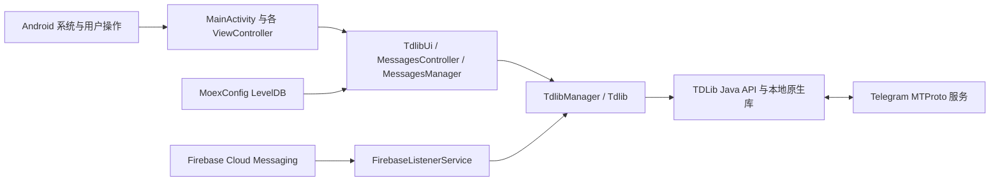

# moeGramX Ghost 项目说明

## 项目用途

本项目是基于 moeGramX、Telegram X 和 TDLib 的 Android Telegram 客户端分支。除上游聊天、媒体、通话和多账号能力外，当前分支加入了 Ghost Mode、Read until、消息过滤、Shadow Ban，以及对 Telegram 公开频道搜索链接的应用内处理。

## 整体架构



应用使用单 Activity 加自定义 `ViewController` 导航栈。`MainActivity` 接收启动、分享和外部链接 Intent；业务页面通过 `TdlibUi`、`Tdlib` 和 TDLib 异步 API 读取或修改 Telegram 状态。TDLib 负责 MTProto 网络连接、账号授权、本地消息数据库与文件下载。

## 主要目录与文件

- `app/`：Android 应用、Java/Kotlin UI、资源、Manifest、JNI 构建入口和产品风味。
- `app/src/main/java/org/thunderdog/challegram/MainActivity.java`：应用入口、导航初始化和外部 Intent 分发。
- `app/src/main/java/org/thunderdog/challegram/ui/MainController.java` 与 `ExternalShareUtils.java`：接收外部文件、提取 URI、推断 MIME 和校验读取范围，生成待确认的分享内容。
- `app/src/main/java/org/thunderdog/challegram/telegram/Tdlib.java`：单账号 TDLib 封装、缓存、更新分发及 Telegram 操作。
- `app/src/main/java/org/thunderdog/challegram/telegram/TdlibUi.java`：把 TDLib 对象和链接类型转换为页面导航、弹窗及其他 UI 行为。
- `app/src/main/java/org/thunderdog/challegram/ui/MessagesController.java`：聊天、消息搜索和消息交互页面。
- `app/src/main/java/org/thunderdog/challegram/component/chat/MessagesManager.java`：消息加载、搜索、列表状态和交互逻辑。
- `app/src/main/java/moe/kirao/mgx/MoexConfig.java`：moeGramX 与本分支功能配置，使用应用私有目录中的 LevelDB。
- `app/src/main/java/moe/kirao/mgx/ui/SettingsMoexController.java`：Ghost Mode、过滤和 Shadow Ban 等设置入口。
- `tdlib/`：TDLib Java API、原生源码和构建配置。
- `patches/tdlib-ghost-mode.patch`：相对 `tdlib/source/td` 的原生 Ghost Mode 修改，包含已读、在线状态以及未读提及和反应内容回执的 TDLib 侧逻辑。
- `tgcalls/`：Telegram 通话相关模块。
- `vkryl/`：UI、核心工具和 LevelDB 等基础模块。
- `extension/`：按构建配置选用的扩展实现。
- `buildSrc/`：Gradle 插件、代码生成和构建任务。
- `scripts/setup.sh`：交互式生成本地构建配置。

## 关键执行流程

### 启动、登录与消息

1. `BaseApplication` 初始化全局组件，`MainActivity` 建立导航栈。
2. `TdlibManager` 加载账号并创建相应 `Tdlib` 实例。
3. 未授权账号由 TDLib 授权状态驱动登录页面；已授权账号进入聊天列表。
4. TDLib 从 Telegram 获取更新并写入自己的本地数据库，再由监听器刷新聊天列表和 `MessagesController`。
5. 消息发送、已读位置、输入状态和搜索请求均通过 TDLib Java API 异步执行。

登录状态不是 Cookie 或 Web Session。账号授权密钥和消息缓存由 TDLib 保存在应用私有数据中；覆盖安装只有在包名和签名满足 Android 更新规则且未清除应用数据时才会保留这些数据。

### Ghost Mode、过滤与 Shadow Ban

`SettingsMoexController` 修改 `MoexConfig` 中的开关和名单。Ghost Mode 在已读、在线状态及输入动作发送路径上决定是否把操作提交给 TDLib；频道、群组和私聊的已读保护分别配置。TDLib 仍拦截普通聊天历史的云端已读位置，但会定向提交已查看消息的未读提及和未读反应内容回执，使 `@` 与表情互动提示不会在后续同步时恢复或累积；这类内容回执不推进聊天的云端已读位置。Ghost 配置写入与 Shadow Ban 自动本地已读请求在 Java 层串行执行，并等待相关 `SetOption` 完成，避免切换开关时使用到错误的聊天类型配置。

消息过滤与 Shadow Ban 在消息列表、回复预览、聊天列表摘要和输入状态展示等本地 UI 路径生效。聊天列表最后一条消息命中过滤词或 Shadow Ban 时，会按 TDLib 历史页异步向前查找并跳过连续命中过滤的消息，直到显示第一条未过滤消息；只有没有更早的可见消息时才保留 `Filtered message` 占位。聊天内加载同时区分 TDLib 返回的原始页与过滤后的可见条目：若普通聊天或线程历史的原始页非空但整页被隐藏，不会清空现有列表或误判历史结束，而是以该页最老或最新的原始消息 ID 沿当前加载方向串行补页。补页每次最多读取 100 条，连续页延迟由 500ms 渐进增加到最多 5 秒，并校验游标确实前进；直到找到可见消息或到达真实原始边界才结束。TDLib 错误不会再被当成空历史页或关闭加载方向。搜索、活动日志、预览和 Force Touch 等使用不同游标或生命周期的来源不会进入这条补页路径，避免重复请求或混入真实聊天历史。

可见聊天行和当前会话的未读数字使用同一套按需计算结果：私聊直接排除被 Shadow Ban 或 Telegram 主黑名单屏蔽的对端；普通群组由 `MoexShadowUnreadManager` 按账号合并手动名单和主黑名单，并在未读较少时扫描共享历史、未读很多时按被屏蔽发送者定向搜索。相同聊天在多个文件夹中的行会复用结果和进行中的请求。若未读中仍有正常用户消息，只修改本地显示数字，不推进连续已读游标；若剩余未读全部来自被屏蔽用户，则 Java 层生成包含聊天、顶部消息、旧已读位置和原始未读数的单次快照令牌，原生 TDLib 校验快照后把本地未读数明确设为 0，并且不发送历史已读回执。`UpdateChatLastMessage` 以及未读数或 `lastReadInboxMessageId` 发生变化且仍有未读时都会触发 150ms 合并检查，因此“混合未读在用户读掉正常消息后只剩隐藏消息”的下降转折也会立即重新计算。初始打开与“到达底部”导航仅在当前聊天或话题没有生效的正则过滤、且没有已知或可能命中的 Shadow Ban 未读时使用 TDLib 原始未读锚点；否则回退到保存位置或聊天底部，避免锚点周围的隐藏消息造成空页或不可达的新消息。自动处理保留用户手动“标为未读”的状态；Secret Chat 为避免触发自毁计时不自动推进，频道、论坛主题也保持 TDLib 原始未读逻辑。过滤或黑名单配置变更后会失效共享结果，并立即重建已缓存聊天文件夹的摘要和派生未读数字。Shadow Ban 名单按账号 ID 存储。

应用内消息转发以及 Android 外部文本、文件等分享都由 `ShareController` 加载可写聊天。未显式指定聊天列表且已启用聊天文件夹时，弹窗优先选择名为 `Personal` 的已启用文件夹，并使用 `Private` 文件夹图标作为重命名或多语言场景的兼容识别；找不到时回退到 All Chats。标题菜单保持 TDLib 返回的账号文件夹顺序，并将 All Chats 固定显示在最后，用户仍可手动切换文件夹。

### 外部文件接收

系统“分享”使用 `ACTION_SEND` / `ACTION_SEND_MULTIPLE`，“打开方式”使用 `ACTION_VIEW`。Manifest 的 `*/*` 只覆盖已声明类型的请求，因此另设不带 MIME 的分享过滤器，以及分别接收有类型和无类型 `content://`、`file://` 文件的 `ACTION_VIEW` 过滤器。本地文件过滤器不接收普通网页或 `tg:` 链接。

`MainActivity` 保留原始 Intent 和 URI 授权，完成解锁、账号选择后交给 `MainController`。`ExternalShareUtils` 优先使用并去重显式 `EXTRA_STREAM` 文件；只有缺少该字段时才从 `ClipData` 获取文件，仍没有文件才回退到本地 data URI，不把仅用于授权或上下文的其他 URI 追加发送。`ACTION_VIEW` 只处理用户点开的 data URI，不追加其他附带文件。每个文件独立推断 MIME：有效的具体声明类型、提供方类型、文件名扩展名，最终兜底 `application/octet-stream`。文件管理器界面显示的“类型为空”不代表图片查看器分享时仍未设置 MIME；普通分享中能确认的图片仍走原有照片流程，不把全部图片强制改为文档，也不新增逐文件扫描内容头的格式探测。

从“打开方式”进入的文件使用 `InputMessageDocument`，关闭自动内容类型转换并保留提供方原始名称，不自动把图片压缩、WebP 改成贴纸或 vCard 改成联系人。普通 `SEND` / `SEND_MULTIPLE` 保持媒体分享行为。全部文件准备完成后才打开现有 `ShareController`，仍需用户选择会话并发送；不会仅因打开文件就自动上传。批次中任一文件无效或不可读取时提示失败并停止整批，不静默发送残缺列表。

外部 `content://` 始终通过原 URI 读取，不相信提供方的 `_data` 字段而直接打开其声称的磁盘路径。`file://` 检查规范化路径、拒绝应用自身私有数据目录和文件夹；只有旧 Android 上确实需要读取外部裸文件路径时才沿用已有存储权限申请，不新增“所有文件访问权限”或 root 依赖。内容 URI 复用现有 TDLib 文件生成器，真正复制发生在发送后的文件生成请求；本轮不新增跨重启缓存或强行获取持久授权，来源撤销授权、删除文件或超出上传限制仍可能导致发送失败。

### Telegram 链接

`AndroidManifest.xml` 将 `t.me`、`telegram.me`、`telegram.dog` 和 `tg:` 链接交给 `MainActivity`。普通链接由 `TdlibUi.openTelegramUrl` 调用 `GetInternalLinkType` 并按返回类型导航。

本轮链接兼容的范围是聊天、消息及消息内目标定位；语音通话和直播链接只需打开对应群聊。以下功能标记为跳过：Stories、故事相册、Mini Apps、附件菜单机器人、付款、Boost、礼物与 Stars 的未实现分支、OAuth、Passport、云主题，以及未实现的设置和内置页面跳转。跳过表示保留现状，不代表已经实现。

对于精确格式 `https://t.me/s/<username>`，客户端通过 `SearchPublicChat` 打开公开聊天；非空 `q=<query>` 使用 URL 解码后的搜索词、`MessagesController.PREVIEW_MODE_SEARCH` 与 `SearchChatMessages` 显示聊天内搜索结果。同聊天内再次打开搜索链接也会进入搜索页面，不会被普通聊天复用逻辑吞掉。

`/s/<username>?before=<id>` 与 `after=<id>` 是网页预览的分页边界，不是精确消息 ID。`PublicChatPreviewLoader` 使用 `GetChatHistory`（带 `q` 时使用 `SearchChatMessages`），找边界之前最近或之后最近的实际可见消息，跳过已删除消息造成的 ID 缺口和命中当前过滤/Shadow Ban 的消息。两者并存时按开区间向旧消息查找。边界仅接受正的 32 位十进制服务器消息 ID；无效参数不参与分页。每页至多 20 条候选（向新消息查找另留一个锚点位置），最多请求 4 页，补页间隔 200ms，并检查原始游标前进；错误包括 429 均立即停止，无可见结果提示 `MessageNotFound`。离开原页面或打开新链接会取消旧查询的导航结果。查询本身不发送已读请求；进入聊天后的已读行为继续服从 Ghost Mode 设置。搜索结果保留 `q` 上下文，相册成员不靠 ID 加减猜测。

`/s/<username>/<messageId>` 以及 `/s/<username>/<topicId>/<messageId>` 会移除 `/s`，保留查询参数并交给 TDLib 的 `GetMessageLinkInfo`。普通公开消息、私有超级群/频道的 `/c/<internalId>/<messageId>`、论坛主题路径以及 `thread`、`comment` 参数沿用 TDLib 的解析。论坛群维持 TGX 原有的全群合并历史：话题路径用于解析目标消息，但不把页面切成仅显示该话题的历史；只有主题、没有具体消息的有效链接打开对应群聊，不误报消息不存在。已有频道评论线程继续使用 `ThreadInfo` 和 `GetMessageThreadHistory`，不与论坛群的话题混为一谈。裸 `topic=` 查询参数不保证被 TDLib 识别。本轮不新增话题列表、话题管理、话题专用历史或按话题隔离滚动位置，也不从普通消息自动推断并强制切换话题。

`MessageLinkInfo` 的消息内目标由 `MessagesManager` 等待实际消息加载后执行一次，并在用户拖动、切页、销毁或下一次消息定位时取消：`single` 打开相册中指定成员的单项预览，`t` 定位支持的音视频播放时间，`option` 居中并短暂高亮投票选项而不投票；`task` 通过只读清单弹窗滚到并高亮指定任务，不改变完成状态。当前尚无原生清单消息布局，这个弹窗不是完整清单编辑器。目标选项/任务已不存在时保留普通消息定位；被过滤而未进入消息列表的内容不触发媒体或任务弹窗。

`tg://openmessage` 的 `account_user_id` 在应用内链接与外部 Intent 中均用于选择本机已登录账号，找不到账号不回退到错误账号。用户名和手机号链接按 `openProfile` 区分资料页与会话；TDLib 返回的草稿仅填入非机器人私聊，不自动发送。带群/频道用户名的 `voicechat`、`videochat`、`livestream` 链接只打开对应聊天，不自动加入通话。独立会议邀请 `t.me/call/<slug>` 不携带对应群信息，仍保持未支持，不猜测目标群。

`tests/PublicChatPreviewPaginationTest.java` 直接测试生产分页策略 `PublicChatPreviewPagination`，无需 Android 环境；它覆盖边界、缺号、隐藏结果、游标与请求上限，不替代设备上的消息跳转、搜索、媒体播放和界面验证。

### 推送与后台运行

Google 构建通过 `FirebaseListenerService` 接收 FCM，再唤醒账号和 TDLib 处理推送。应用被 Android 普通回收后仍可由 FCM 唤醒；如果系统或第三方管理工具对包执行 force-stop，Android 会将其标记为 stopped，用户再次手动启动前不会接收这类唤醒。

## 数据与配置

- TDLib 数据库：账号授权、聊天和消息缓存，位于应用私有目录，由 TDLib 管理。
- `MoexConfig`：`files/moexconf/db` LevelDB，保存本分支与 moeGramX 设置、过滤规则和按账号区分的 Shadow Ban 用户 ID。
- Android 设置及其他 TGX 配置：由上游 `Settings` 等组件管理。
- 下载文件和媒体缓存：由 TDLib 与 Android 存储策略共同管理。

项目没有自建业务后端。主要外部服务是 Telegram MTProto、Firebase Cloud Messaging，以及构建时声明的 Google/地图等可选服务。

## 构建配置与敏感信息

`properties.gradle.kts` 和 setup 生成的本地配置决定 application ID、版本、Telegram `api_id/api_hash`、扩展和构建风味。`app/google-services.json` 必须与实际 application ID 对应。正式 APK 的签名配置应放在仓库外部，并由本地 properties 文件引用。

不得提交 keystore、签名密码、私有 Telegram 凭据或不应公开的 Firebase 配置。更换包名、签名或 Firebase 项目会影响覆盖安装、App Links、登录数据继承和推送注册。

## 本地构建与验证

推荐在 WSL/Linux 中使用 OpenJDK 21，并完整初始化 Git 子模块和 Git LFS：

```bash
ABIS=arm64-v8a scripts/setup.sh
git -C tdlib/source/td apply --unidiff-zero ../../../patches/tdlib-ghost-mode.patch
# 使用 tdlib/source/ 中的脚本重建并安装 libtdjni.so
./gradlew assembleLatestArm64Release
```

arm64 release APK 输出到 `app/build/outputs/apk/latestArm64/release/`。编译成功只证明代码和资源可打包；涉及 Intent、推送、已读和 UI 的修改还应在实际 Android 设备上安装并完成端到端操作验证。

`./gradlew -p tests/external-share-android runChecks` 在独立 JVM 工程中读取当前 Manifest，调用 Android 16 框架的 `IntentFilter.match`，并直接编译生产 `ExternalShareUtils` 检查 URI 提取、MIME 优先级和路径边界。首次运行下载 `android-all` 测试依赖，不加入 APK；少量应用工具依赖使用测试替身。它不验证真实 ContentProvider 授权、分享界面操作、TDLib 上传或收件结果，不能代替手机端到端测试。

本项目的交付约定：每次完成修改并进行可用的验证后，将本次源码提交推送到 `publish` 远端的 `moe` 分支（`Entermage/moeGramX-ghost`），并把对应 ARM64 Release APK 上传到 GitHub Release，向用户提供 Release 页面和 APK 下载直链。仅给本地文件路径不算完成可下载交付；不向 `origin` 上游提交 PR。Release 使用递增的 `ghost.N` 标签，标题与 APK 名称保持简洁，发布说明按用户约定留空；没有连接设备时明确说明未实机验证，不把编译或签名校验称作端到端测试。

## 日志与错误处理

Java 层统一使用项目的 `Log` 工具；TDLib 请求通常通过 typed handler 或 `(result, error)` 回调处理。链接解析失败应回退到原有 TDLib/浏览器路径，聊天查询错误通过现有 `showChatOpenError` 和链接提示 UI 展示。原生崩溃、数据库错误和 TDLib 日志沿用上游诊断机制。
