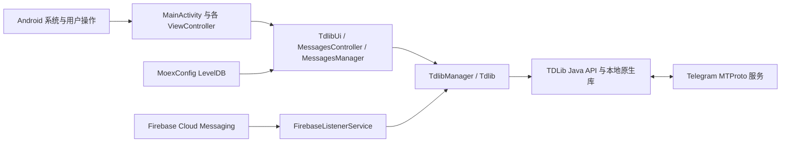

# moeGramX Ghost 项目说明

## 项目用途

本项目是基于 moeGramX、Telegram X 和 TDLib 的 Android Telegram 客户端分支。除上游聊天、媒体、通话和多账号能力外，当前分支加入了 Ghost Mode、Read until、消息过滤、Shadow Ban，以及对 Telegram 公开频道搜索链接的应用内处理。

## 整体架构



应用使用单 Activity 加自定义 `ViewController` 导航栈。`MainActivity` 接收启动、分享和外部链接 Intent；业务页面通过 `TdlibUi`、`Tdlib` 和 TDLib 异步 API 读取或修改 Telegram 状态。TDLib 负责 MTProto 网络连接、账号授权、本地消息数据库与文件下载。

## 主要目录与文件

- `app/`：Android 应用、Java/Kotlin UI、资源、Manifest、JNI 构建入口和产品风味。
- `app/src/main/java/org/thunderdog/challegram/MainActivity.java`：应用入口、导航初始化和外部 Intent 分发。
- `app/src/main/java/org/thunderdog/challegram/telegram/Tdlib.java`：单账号 TDLib 封装、缓存、更新分发及 Telegram 操作。
- `app/src/main/java/org/thunderdog/challegram/telegram/TdlibUi.java`：把 TDLib 对象和链接类型转换为页面导航、弹窗及其他 UI 行为。
- `app/src/main/java/org/thunderdog/challegram/ui/MessagesController.java`：聊天、消息搜索和消息交互页面。
- `app/src/main/java/org/thunderdog/challegram/component/chat/MessagesManager.java`：消息加载、搜索、列表状态和交互逻辑。
- `app/src/main/java/moe/kirao/mgx/MoexConfig.java`：moeGramX 与本分支功能配置，使用应用私有目录中的 LevelDB。
- `app/src/main/java/moe/kirao/mgx/ui/SettingsMoexController.java`：Ghost Mode、过滤和 Shadow Ban 等设置入口。
- `tdlib/`：TDLib Java API、原生源码和构建配置。
- `tgcalls/`：Telegram 通话相关模块。
- `vkryl/`：UI、核心工具和 LevelDB 等基础模块。
- `extension/`：按构建配置选用的扩展实现。
- `buildSrc/`：Gradle 插件、代码生成和构建任务。
- `scripts/setup.sh`：交互式生成本地构建配置。

## 关键执行流程

### 启动、登录与消息

1. `BaseApplication` 初始化全局组件，`MainActivity` 建立导航栈。
2. `TdlibManager` 加载账号并创建相应 `Tdlib` 实例。
3. 未授权账号由 TDLib 授权状态驱动登录页面；已授权账号进入聊天列表。
4. TDLib 从 Telegram 获取更新并写入自己的本地数据库，再由监听器刷新聊天列表和 `MessagesController`。
5. 消息发送、已读位置、输入状态和搜索请求均通过 TDLib Java API 异步执行。

登录状态不是 Cookie 或 Web Session。账号授权密钥和消息缓存由 TDLib 保存在应用私有数据中；覆盖安装只有在包名和签名满足 Android 更新规则且未清除应用数据时才会保留这些数据。

### Ghost Mode、过滤与 Shadow Ban

`SettingsMoexController` 修改 `MoexConfig` 中的开关和名单。Ghost Mode 在已读、在线状态及输入动作发送路径上决定是否把操作提交给 TDLib；频道、群组和私聊的已读保护分别配置。消息过滤与 Shadow Ban 在消息列表、回复预览、聊天列表摘要和输入状态展示等本地 UI 路径生效，不改变 Telegram 服务端数据。聊天列表最后一条消息命中过滤词或 Shadow Ban 时，会异步查找并显示上一条未过滤消息；过滤配置变更后会立即重建所有已缓存聊天文件夹的摘要。Shadow Ban 名单按账号 ID 存储。

### Telegram 链接

`AndroidManifest.xml` 将 `t.me`、`telegram.me`、`telegram.dog` 和 `tg:` 链接交给 `MainActivity`。普通链接由 `TdlibUi.openTelegramUrl` 调用 `GetInternalLinkType` 并按返回类型导航。

对于精确格式 `https://t.me/s/<username>`，客户端解析用户名并通过 `SearchPublicChat` 直接打开对应公开聊天；如果链接还带有非空 `q=<query>`，则继续使用 URL 解码后的搜索词、`MessagesController.PREVIEW_MODE_SEARCH` 与 `SearchChatMessages` 显示聊天内搜索结果。`/s/<username>/<messageId>` 以及论坛主题形式 `/s/<username>/<topicId>/<messageId>` 同时适用于公开频道和公开群组：客户端移除公开预览路径中的 `/s`，保留 `thread`、`topic`、`comment` 等查询参数，再交给 TDLib 的 `GetMessageLinkInfo` 定位对应消息。私有超级群和私有频道使用的 `/c/<internalId>/<messageId>` 继续由 TDLib 原生处理。

### 推送与后台运行

Google 构建通过 `FirebaseListenerService` 接收 FCM，再唤醒账号和 TDLib 处理推送。应用被 Android 普通回收后仍可由 FCM 唤醒；如果系统或第三方管理工具对包执行 force-stop，Android 会将其标记为 stopped，用户再次手动启动前不会接收这类唤醒。

## 数据与配置

- TDLib 数据库：账号授权、聊天和消息缓存，位于应用私有目录，由 TDLib 管理。
- `MoexConfig`：`files/moexconf/db` LevelDB，保存本分支与 moeGramX 设置、过滤规则和按账号区分的 Shadow Ban 用户 ID。
- Android 设置及其他 TGX 配置：由上游 `Settings` 等组件管理。
- 下载文件和媒体缓存：由 TDLib 与 Android 存储策略共同管理。

项目没有自建业务后端。主要外部服务是 Telegram MTProto、Firebase Cloud Messaging，以及构建时声明的 Google/地图等可选服务。

## 构建配置与敏感信息

`properties.gradle.kts` 和 setup 生成的本地配置决定 application ID、版本、Telegram `api_id/api_hash`、扩展和构建风味。`app/google-services.json` 必须与实际 application ID 对应。正式 APK 的签名配置应放在仓库外部，并由本地 properties 文件引用。

不得提交 keystore、签名密码、私有 Telegram 凭据或不应公开的 Firebase 配置。更换包名、签名或 Firebase 项目会影响覆盖安装、App Links、登录数据继承和推送注册。

## 本地构建与验证

推荐在 WSL/Linux 中使用 OpenJDK 21，并完整初始化 Git 子模块和 Git LFS：

```bash
ABIS=arm64-v8a scripts/setup.sh
./gradlew assembleLatestArm64Release
```

arm64 release APK 输出到 `app/build/outputs/apk/latestArm64/release/`。编译成功只证明代码和资源可打包；涉及 Intent、推送、已读和 UI 的修改还应在实际 Android 设备上安装并完成端到端操作验证。

## 日志与错误处理

Java 层统一使用项目的 `Log` 工具；TDLib 请求通常通过 typed handler 或 `(result, error)` 回调处理。链接解析失败应回退到原有 TDLib/浏览器路径，聊天查询错误通过现有 `showChatOpenError` 和链接提示 UI 展示。原生崩溃、数据库错误和 TDLib 日志沿用上游诊断机制。
